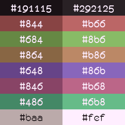

# layla color scheme
hi this is my color scheme which i egotistically named after myself because i didn't know what else to call it. i thought i might as well make this public since my Colloid forks for this theme also are.

## colors!

## config files in this repository
- **xfce4-terminal** color scheme (put this in `~/.local/share/xfce4/terminal/colorschemes`)
- **PrismLauncher** theme (create a folder in `~/.local/share/PrismLauncher/themes`)
more things will be added here as i make them

## my other adaptations of this theme
- [Colloid-layla-gtk-theme](https://github.com/MelodicCatgirl/Colloid-layla-gtk-theme) (which i also use with Qt applications via qt5-styleplugins and qt6gtk2)
- [Colloid-layla-icon-theme](https://github.com/MelodicCatgirl/Colloid-layla-icon-theme)
