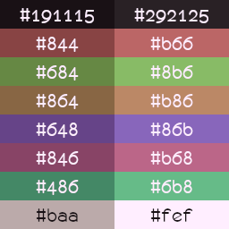

# layla color scheme
hi this is my color scheme which i egotistically named after myself because i didn't know what else to call it. i thought i might as well make this public since my Colloid forks for this theme also are. this originally started as a terminal color scheme but then i adapted it to other things.

## colors!

## config files in this repository
- **xfce4-terminal** color scheme (put this in `~/.local/share/xfce4/terminal/colorschemes/`)
- **Qt** color scheme (put this in `~/.config/qt6ct/colors/` and/or `~/.config/qt5ct/colors/`)
- **Helium** theme (load as an unpacked extension)
- **Termux** color scheme (put this in `~/.termux/`)
- **PrismLauncher** theme (create a folder in `~/.local/share/PrismLauncher/themes/`)
- **RetroArch** rgui color scheme

and a desktop wallpaper I made

more things will be added here as i make them

## my other adaptations of this theme
- [Colloid-layla-gtk-theme](https://github.com/MelodicCatgirl/Colloid-layla-gtk-theme)
- [Colloid-layla-icon-theme](https://github.com/MelodicCatgirl/Colloid-layla-icon-theme)
